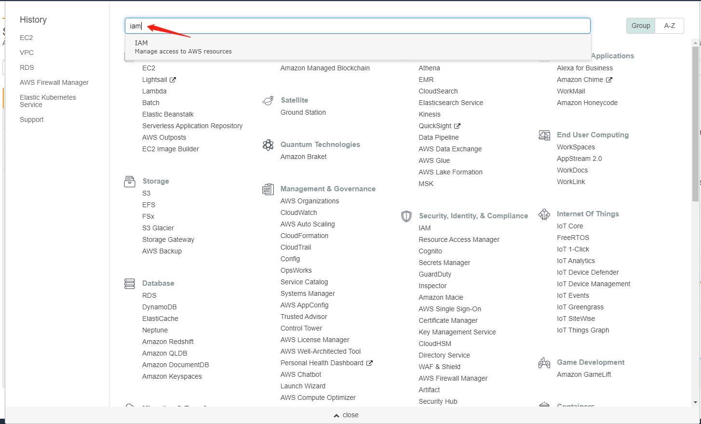
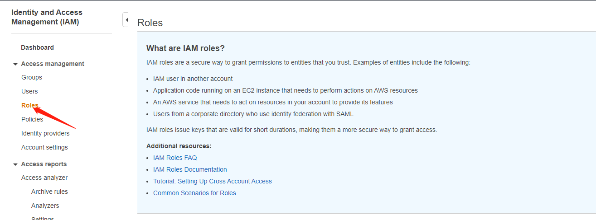
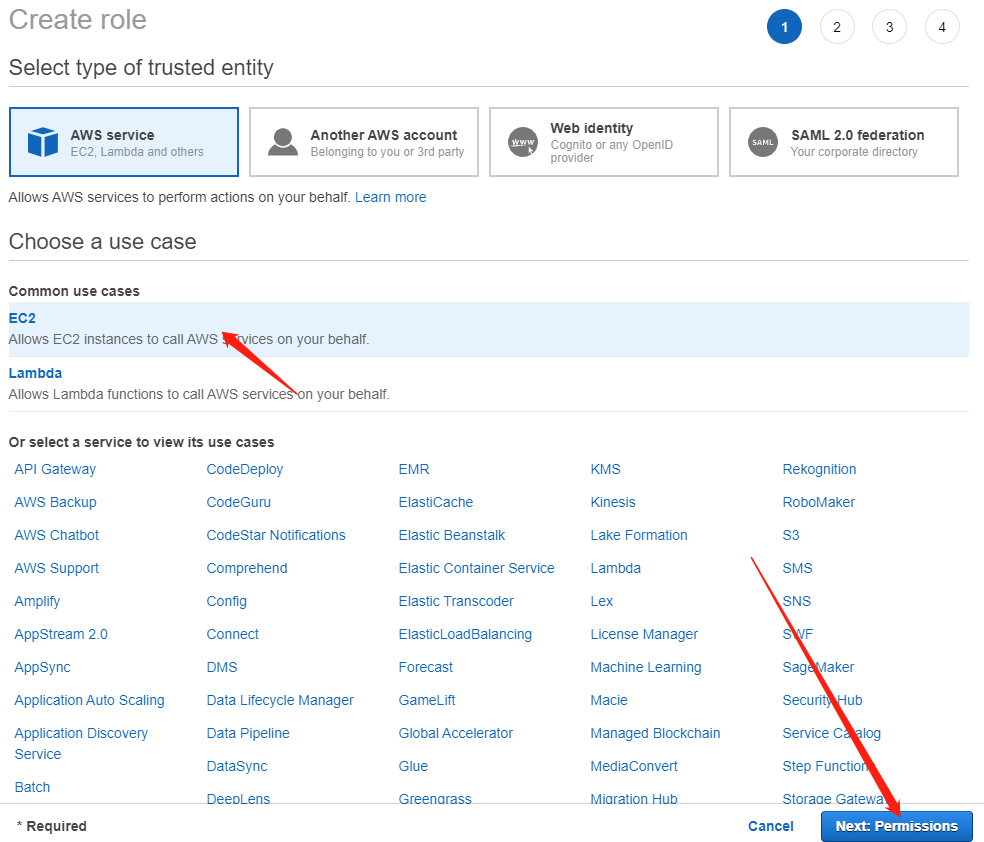
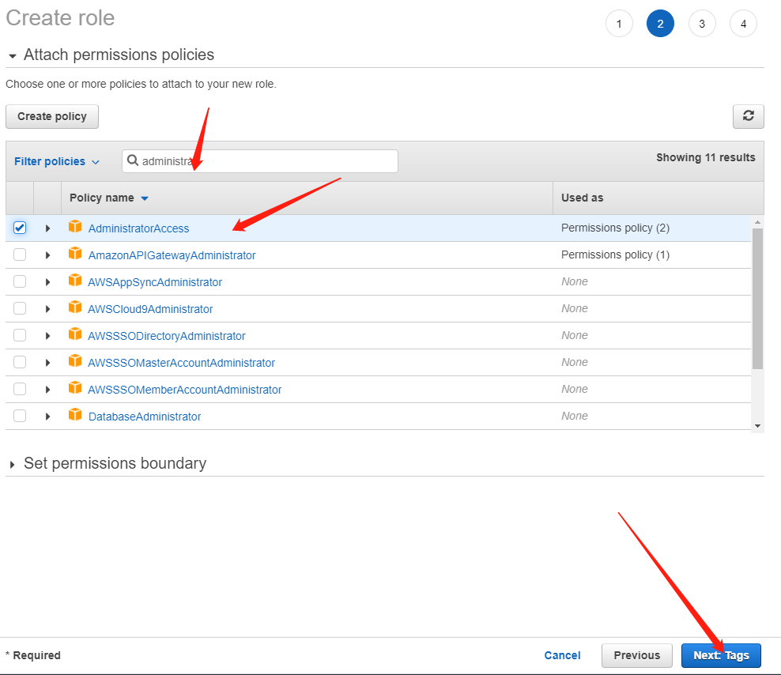
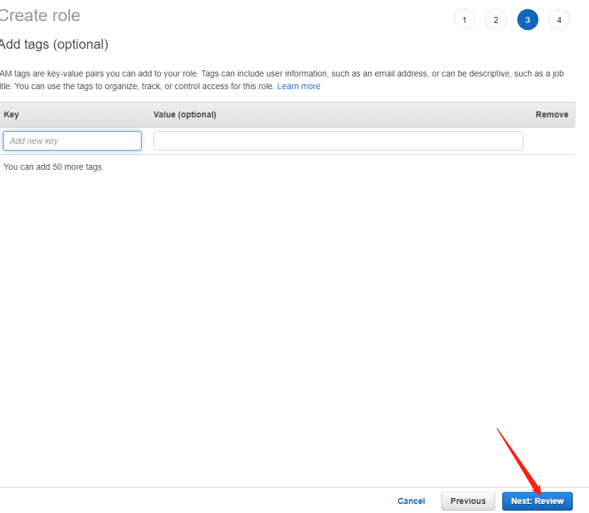
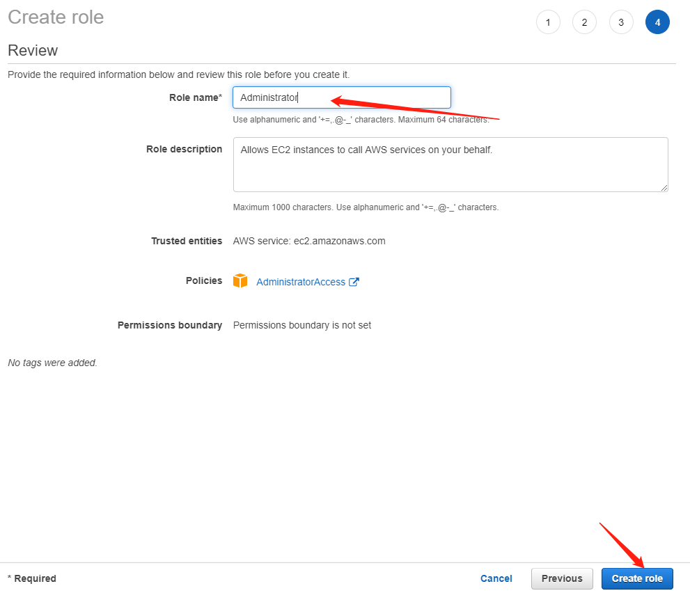
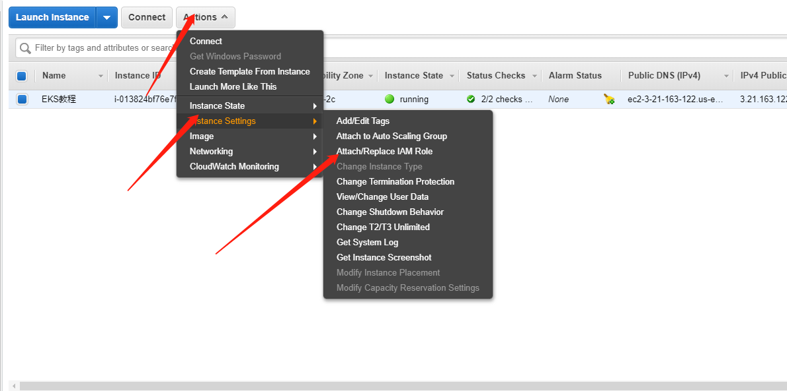
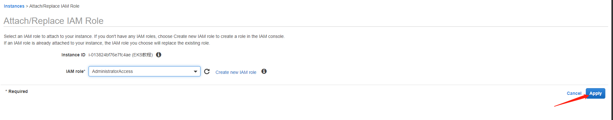

# 什么是eksctl
eksctl是用于在EKS上创建集群的简单CLI工具，EKS是Amazon针对的是EC2上托管的Kubernetes服务。它由Goave编写，使用CloudFormation部署，由[Weaveworks](https://www.weave.works/)创建

## 在EC2中部署eksctl
因为我们选用得是Amazon Linux 2 类型得实例，所以它自带了python3 与 aws 处理命令,但是我们依旧要升级一下版本，让它大于1.18得版本
```
[ec2-user@ip-172-31-36-214 ~]$ aws --version
aws-cli/1.16.300 Python/2.7.18 Linux/4.14.186-146.268.amzn2.x86_64 botocore/1.13.36
```
升级到AWS CLI版本2
```
curl "https://awscli.amazonaws.com/awscli-exe-linux-x86_64.zip" -o "awscliv2.zip"
unzip awscliv2.zip
sudo ./aws/install
```
查看一下版本
```
[ec2-user@ip-172-31-36-214 ~]$ /usr/local/bin/aws --version
aws-cli/2.0.42 Python/3.7.3 Linux/4.14.186-146.268.amzn2.x86_64 exe/x86_64.amzn.2
```
安装eksctl
```
curl --silent --location "https://github.com/weaveworks/eksctl/releases/latest/download/eksctl_$(uname -s)_amd64.tar.gz" | tar xz -C /tmp
sudo mv /tmp/eksctl /usr/local/bin
eksctl version
```
## 在EC2中部署kubectl
```
curl -o kubectl https://amazon-eks.s3.us-west-2.amazonaws.com/1.16.13/2020-08-04/bin/linux/amd64/kubectl
chmod +x ./kubectl
```
## 在EC2中部署Helm
```
curl https://raw.githubusercontent.com/helm/helm/master/scripts/get-helm-3 > get_helm.sh
chmod 700 get_helm.sh
./get_helm.sh
helm version
```
### 安装helm push 插件
```
sudo yum install git -y
helm plugin install https://github.com/chartmuseum/helm-push.git
```
## 为EC2附加administrator权限






创建IAM成功之后我们去给EC2附加超级管理员权限


管理节点部署完毕