# 什么是 Amazon EKS
Amazon Elastic Kubernetes Service (Amazon EKS) 是一项托管服务，可让您在 AWS 上轻松运行 Kubernetes，而无需支持或维护您自己的 Kubernetes 控制层面。Kubernetes 是一个用于实现容器化应用程序的部署、扩展和管理的自动化的开源系统。

Amazon EKS 跨多个可用区运行 Kubernetes 控制层面实例以确保高可用性。Amazon EKS 可以自动检测和替换运行状况不佳的控制层面实例，并为它们提供自动版本升级和修补。

Amazon EKS 还与许多 AWS 服务集成以便为您的应用程序提供可扩展性和安全性，包括：

- 用于容器镜像的 Amazon ECR
- 用于负载分配的 Elastic Load Balancing
- 用于身份验证的 IAM
- 用于隔离的 Amazon VPC
- 用于动态扩容的 AutoScaler
- 用于管理域名的 Route53

Amazon EKS 运行最新版本的开源 Kubernetes 软件，因此您可以使用 Kubernetes 社区的所有现有插件和工具。在 Amazon EKS 上运行的应用程序与在任何标准 Kubernetes 环境中运行的应用程序完全兼容，无论此类环境是在本地数据中心还是在公有云中运行都是如此。这意味着，您可以轻松地将任何标准 Kubernetes 应用程序迁移到 Amazon EKS，而无需进行任何代码修改。

# 在EC2 上部署EKS管理节点
## 创建一个EC2
在Ohio Region 上创建一个EC2  
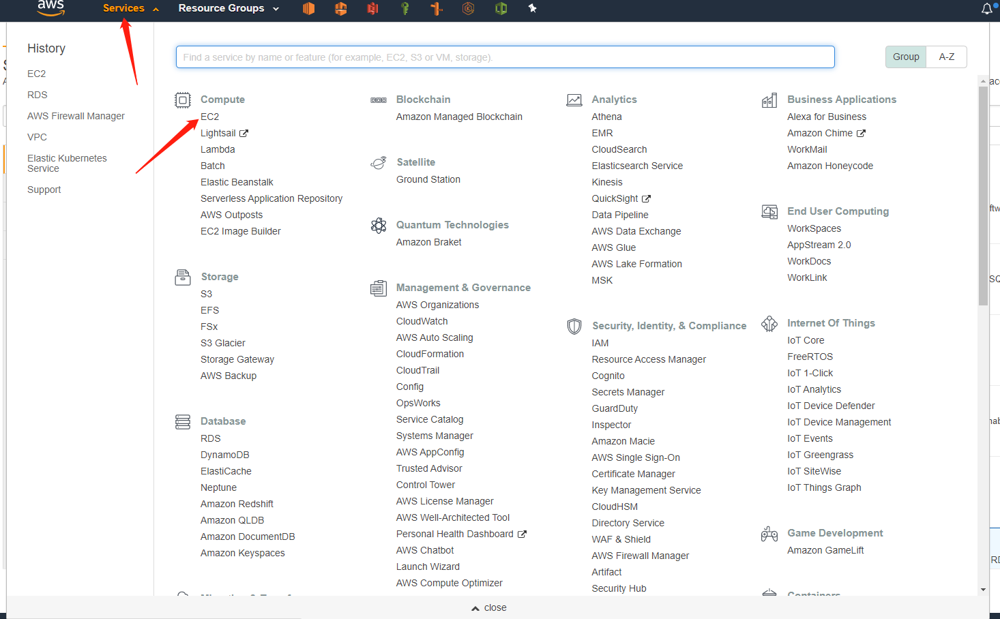
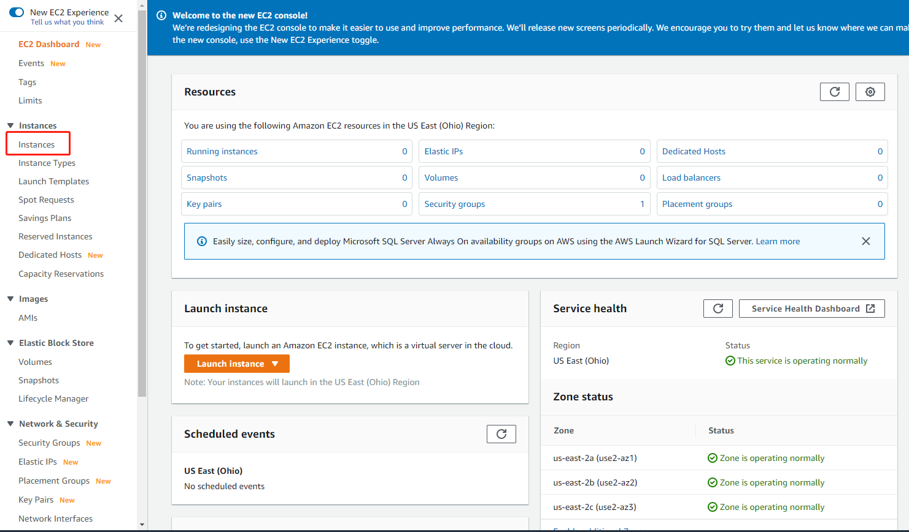
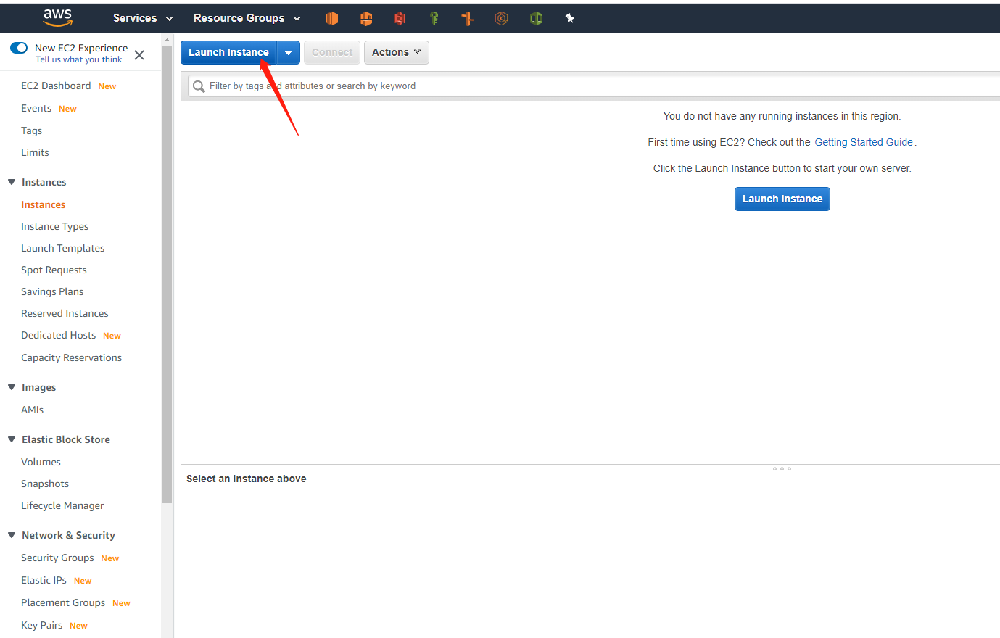
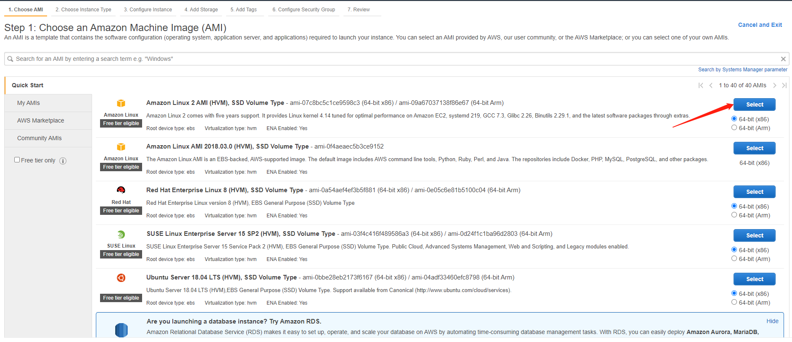
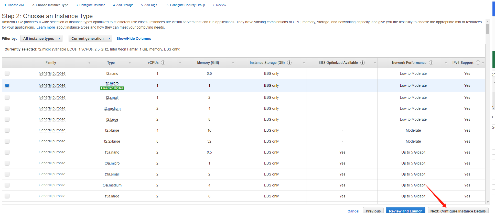
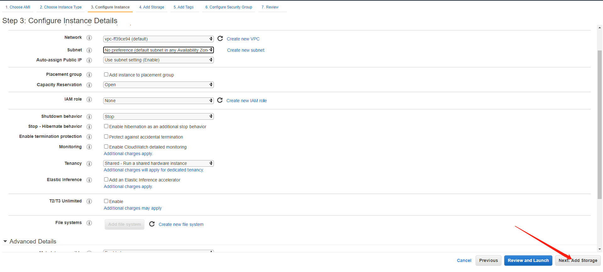
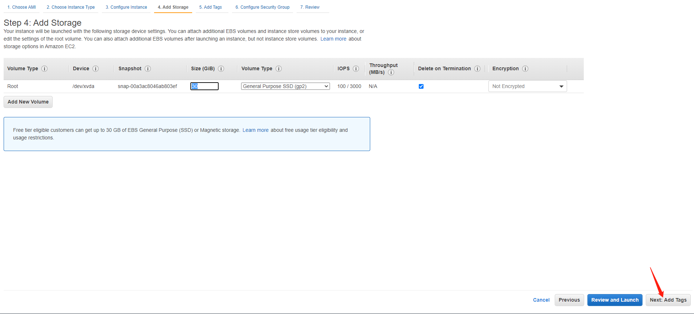
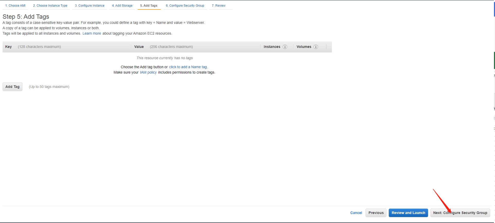
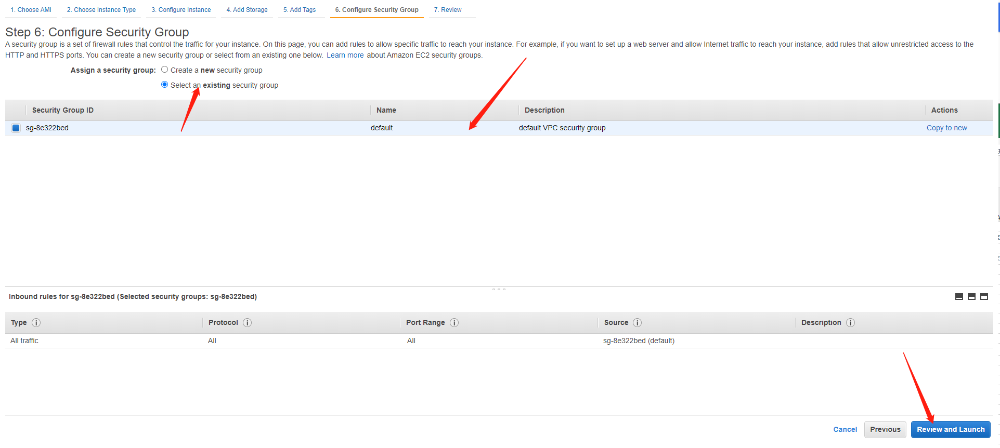
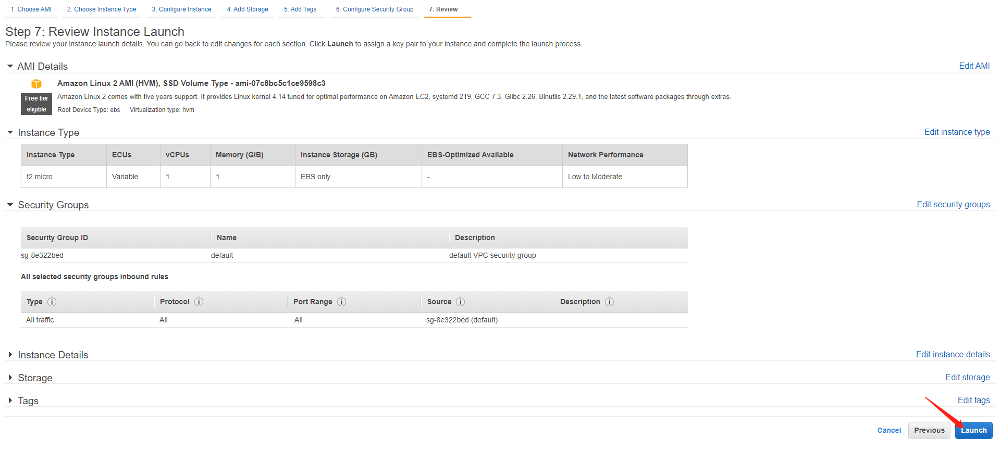
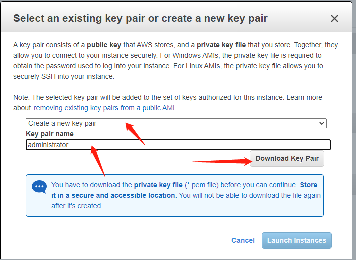

修改EC2 安全组开放22端口


EC2创建成功后记录ip地址与刚才下载得私钥使用shell去登录这台EC2服务器,用户名为ec2-user  
登录成功后
```
Connecting to 3.21.163.122:22...
Connection established.
To escape to local shell, press Ctrl+Alt+].

WARNING! The remote SSH server rejected X11 forwarding request.

       __|  __|_  )
       _|  (     /   Amazon Linux 2 AMI
      ___|\___|___|

https://aws.amazon.com/amazon-linux-2/
7 package(s) needed for security, out of 14 available
Run "sudo yum update" to apply all updates.
[ec2-user@ip-172-31-36-214 ~]$ 
```